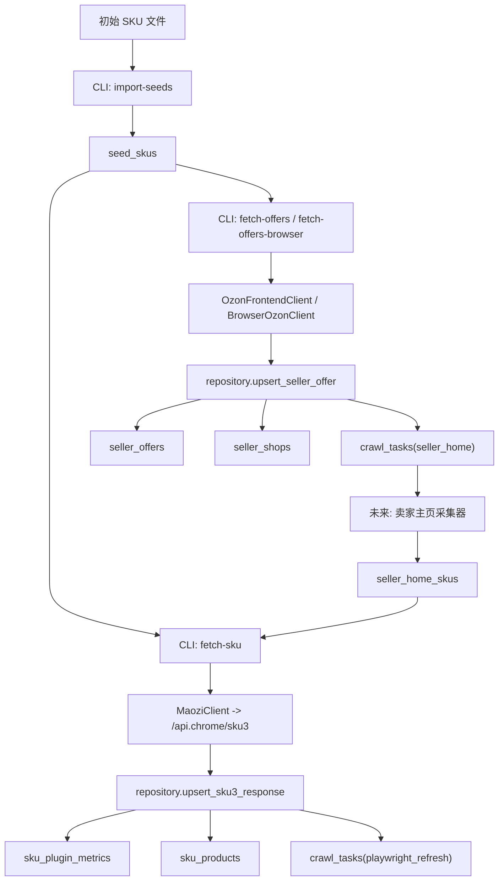

# Ozon 选品采集管道

## 1. 项目概述

这是一个围绕 **Ozon 选品** 搭建的基础采集管道，目标是把以下两类数据稳定写入 MySQL，供后续分析、筛选和扩展：

1. **毛子 ERP 插件的结构化数据**
2. **Ozon 商品的跟卖卖家列表数据**

项目当前的定位不是“完整成品”，而是一个已经可运行的 **第一版数据底座**：

- 已经完成数据库设计与建表。
- 已经完成初始 SKU 入库。
- 已经完成毛子插件 `sku3` 采集，并支持“直连 API 失败时自动回退到插件扩展页请求”。
- 已经完成 Ozon 跟卖列表采集并入库。
- 已经实现基础去重逻辑。
- 已经实现卖家主页的“一个月内不重复采集”约束所需的数据结构与任务预留。
- 已经实现当 `sku3` 返回“需要刷新销售/变体数据”时，自动向任务表写入 `playwright_refresh` 任务。
- 已经接入第一版选品规则闸门，只有命中规则的 SKU 才写入产品明细表。
- 已经实现卖家主页商品链接抓取，以及 `crawl-seller` 的整链路验证命令。

项目还没有完成的部分也需要明确说明：

- 还没有实现持续运行的 worker。
- 还没有实现自动刷新毛子 token。
- 还没有实现自动判定“优质 SKU”的规则引擎。
- 还没有实现完整的并发、重试、限速、代理池策略。

所以，这个仓库现在最适合做两件事：

1. 作为后续完整采集系统的骨架。
2. 作为单 SKU / 小批量数据验证工具，确认接口、字段、入库结构都正确。

---

## 2. 当前实现范围

### 已实现

- 读取 `.env` 配置并初始化运行环境。
- 创建 `ozon_selection` 数据库及核心数据表。
- 从 TXT / CSV 导入初始 SKU。
- 请求毛子 ERP `sku3` 接口并落库。
- 当 Python 直连毛子接口被拦截时，自动回退到已登录插件扩展页上下文发起 `sku3` 请求。
- 请求 Ozon `otherOffersFromSellers` 跟卖列表并落库。
- 当直连 Ozon 返回 `403` 时，通过 Playwright + Chrome 持久化用户目录采集跟卖列表。
- 优先通过 Ozon 卖家页 `entrypoint-api` 接口抓取首页商品链接，失败时才回退到 DOM 滚动抓取。
- 抓取卖家主页商品链接并写入 `seller_home_skus`。
- 通过 `crawl-seller` 复现“卖家主页 -> SKU -> 规则判断 -> 条件式入库”的完整链路。
- 通过 `crawl-seller-network` 从根卖家继续扩展到符合条件 SKU 的跟卖卖家，并对已采集跟卖卖家做 30 天屏蔽。
- 对 SKU、卖家、卖家报价、任务进行幂等写入。
- 对卖家主页采集做“最近 X 天不重复”的基础约束。

### 已预留但未完成

- `seller_home` 任务消费逻辑。
- `playwright_refresh` 任务消费逻辑。
- 任务调度器和多进程 / 多实例 worker。
- 更通用的多规则配置、后台规则管理和优先级排序。

### 当前不在本项目实现范围内

- Ozon 店铺后台的业务操作自动化。
- 图形化管理后台。
- 最终报表展示系统。
- 大规模分布式调度平台。

---

## 3. 这个项目解决的核心问题

如果只靠人工使用插件做选品，会遇到三个问题：

1. 单次查看效率高，但无法形成自己的历史数据库。
2. 看到一个潜力 SKU 后，无法方便地沿着跟卖卖家继续扩展商品池。
3. 数据分散在网页和插件卡片里，不方便自动筛选。

这个项目的思路是把流程拆成三段：

1. 先给定一批初始 SKU。
2. 拉取这些 SKU 的插件数据和跟卖列表。
3. 以跟卖卖家为扩展节点，进入卖家主页继续发现 SKU，并把对应数据继续入库。

最终形成的链路是：

`初始 SKU -> 插件数据 -> 跟卖卖家 -> 卖家主页 SKU -> 插件数据 -> 数据库分析`

---

## 4. 整体架构



可以把它理解成三层：

- **采集入口层**：`cli.py`
- **数据源访问层**：`maozi_api.py`、`ozon_frontend.py`、`browser_ozon.py`
- **持久化与规则层**：`repository.py`、`db.py`、`sql/001_init.sql`

---

## 5. 数据来源说明

本项目目前使用两条数据源链路。

### 5.1 毛子 ERP 插件数据

来源接口：

`POST https://api.maozierp.com/api.chrome/sku3?sku=<sku>`

特点：

- 需要 `Authorization: Bearer <token>`
- 需要 `Client: plugin`
- 需要 `Plugin-Version`
- 返回的是插件卡片背后的结构化 JSON，而不是网页可见文字

这条链路的优势是：

- 字段更稳定
- 结构化程度高
- 不需要从卡片 DOM 里重新解析文本

当前项目通过 `MaoziClient.sku3()` 调用该接口。

### 5.2 Ozon 跟卖卖家列表

来源接口：

`GET https://www.ozon.ru/api/entrypoint-api.bx/page/json/v2?url=/modal/otherOffersFromSellers?product_id=<sku>`

特点：

- 返回 Ozon 前端页面 JSON
- 跟卖卖家列表藏在 `widgetStates` 中的 `webSellerList-*` 节点
- 直连时有概率返回 `403`

当前项目提供两种采集方式：

1. `OzonFrontendClient`：直接 HTTP 请求
2. `BrowserOzonClient`：在真实 Chrome 上下文中通过 `fetch()` 请求

浏览器模式更接近人工访问环境，适合作为 `403` 的回退方案。

---

## 6. 目录结构

```text
ozon_selection_pipeline/
├─ .env.example
├─ .gitignore
├─ README.md
├─ requirements.txt
├─ sql/
│  └─ 001_init.sql
└─ ozon_pipeline/
   ├─ __init__.py
   ├─ browser_ozon.py
   ├─ cli.py
   ├─ config.py
   ├─ db.py
   ├─ maozi_api.py
   ├─ ozon_frontend.py
   ├─ repository.py
   └─ util.py
```

目录职责可以简单理解为：

- 根目录放配置、依赖、说明文档。
- `sql/` 放数据库迁移脚本。
- `ozon_pipeline/` 放 Python 业务代码。

---

## 7. 模块详解

这一部分是本 README 的核心，按文件说明每个模块负责什么、内部如何协作、后续应该往哪里扩。

### 7.1 `ozon_pipeline/config.py`

职责：

- 计算项目根目录 `ROOT_DIR`
- 从 `.env` 读取配置
- 提供统一的 `Settings` 对象给其他模块使用

关键点：

- `load_dotenv(ROOT_DIR / ".env")` 会在模块导入时自动加载环境变量。
- `Settings` 使用 `dataclass(frozen=True)`，表示配置对象初始化后不允许修改。
- 所有默认值都写在这里，是项目运行参数的唯一真源。

当前包含的配置分为四类。

#### 数据库配置

- `DB_HOST`
- `DB_PORT`
- `DB_USER`
- `DB_PASSWORD`
- `DB_NAME`

#### 毛子 API 配置

- `MAOZI_TOKEN`
- `MAOZI_BASE_URL`
- `MAOZI_PLUGIN_VERSION`

#### 请求与网络配置

- `SELLER_RECOLLECT_DAYS`
- `REQUEST_TIMEOUT_SECONDS`
- `REQUESTS_TRUST_ENV`
- `HTTP_PROXY_URL`
- `HTTPS_PROXY_URL`

#### 浏览器采集配置

- `CHROME_PROFILE_DIR`
- `CHROME_EXTENSION_DIR`
- `CHROME_EXECUTABLE_PATH`
- `CHROME_CHANNEL`
- `CHROME_HEADLESS`

设计上的意义：

- 让所有网络、数据库、浏览器行为都通过配置控制。
- 后续迁移到 Ubuntu、Docker、服务器批量部署时，不需要改代码，只需要改 `.env`。

---

### 7.2 `ozon_pipeline/db.py`

职责：

- 提供最基础的数据库访问能力
- 执行 SQL 文件
- 执行单条 SQL
- 查询单条 / 多条记录

这是整个项目的“最低层”，其他业务模块不直接接触 `pymysql.connect()`，而是通过这里统一访问数据库。

#### 关键函数

`connect(database: Optional[str] | object = _DEFAULT_DATABASE)`

作用：

- 创建数据库连接。
- 默认连接到 `settings.db_name` 指定的数据库。
- 也支持传入 `database=None`，在还没有创建数据库时先连 MySQL 实例本身。

这就是为什么建库脚本可以先执行 `CREATE DATABASE`，再 `USE ozon_selection`。

`run_sql_file(path: Path)`

作用：

- 读取 `.sql` 文件
- 用 `split_sql()` 分割多条语句
- 顺序执行

`split_sql(sql: str)`

作用：

- 跳过空行和 `--` 注释
- 以分号结尾识别一条完整 SQL

这是一个简化版 SQL 分割器，足够支持当前迁移脚本。

`execute(sql, params)`

作用：

- 执行增删改语句
- 自动提交事务
- 返回影响行数

`fetch_one(sql, params)` / `fetch_all(sql, params)`

作用：

- 分别查询一条或多条记录
- 使用 `DictCursor`，返回字典而不是元组

设计上的意义：

- 业务代码不需要关心连接创建和提交事务。
- 查询结果直接是字典，便于和 JSON / Python 对象处理风格保持一致。

---

### 7.3 `ozon_pipeline/util.py`

职责：

- 放一些通用、无副作用的小工具函数

这个模块虽然短，但非常关键，因为采集类项目经常要处理“字符串数字化”“链接标准化”“唯一键生成”这类杂务。

#### 核心常量

`OZON_BASE = "https://www.ozon.ru"`

用于统一拼接站内相对路径。

#### 核心函数

`json_dumps(value)`

作用：

- 把 Python 对象序列化成紧凑 JSON 字符串
- `ensure_ascii=False`，确保中文、俄文等字符不会被强制转义

`to_decimal(value)`

作用：

- 尽量把各种形式的数字文本转成 `Decimal`
- 兼容百分号、空格、小数点、小数逗号

这个函数是整个项目数值清洗的基础。

`to_int(value)`

作用：

- 基于 `to_decimal()` 继续转成整数

`percent_text_to_decimal(value)`

作用：

- 目前只是复用 `to_decimal()`
- 后续如果要严格区分百分比语义，可以在这里扩展

`grams_from_text(value)`

作用：

- 目前也是直接调用 `to_decimal()`
- 后续如果出现 `kg`、`g`、`mg` 等不同单位，需要在这里统一换算

`normalize_url(value)`

作用：

- 把 Ozon 相对链接转成绝对链接
- 如果为空则返回空字符串

`seller_key(home_url)`

作用：

- 先把卖家主页 URL 标准化
- 再生成 SHA1 哈希

意义：

- 用稳定的 `seller_key` 作为卖家主键
- 避免把长 URL 直接拿来当表主键

`price_text(value)`

作用：

- 从 Ozon 返回的 seller JSON 中取价格文本
- 优先 `cardPrice.price`，其次 `price.price`

设计上的意义：

- 把“脏数据清洗逻辑”集中管理。
- 后续如果 Ozon 字段结构变化，只需要集中修改，而不是每个模块都找一遍。

---

### 7.4 `ozon_pipeline/maozi_api.py`

职责：

- 负责和毛子 ERP 接口通信

当前只实现了一个能力：

- 拉取单个 SKU 的 `sku3` 数据

#### 类：`MaoziClient`

初始化时会做三件事：

1. 读取 token
2. 创建 `requests.Session()`
3. 根据配置决定是否继承系统代理、是否显式设置代理

这部分设计很实用，因为服务器环境里经常会遇到：

- 机器本身设置了代理
- 请求库自动继承了错误代理
- 某些接口必须直连，某些接口必须走代理

`REQUESTS_TRUST_ENV=false` 就是为了避免“明明代码没配代理，但系统环境变量把请求导偏了”。

#### 方法：`sku3(self, sku: str)`

功能：

- 校验 `MAOZI_TOKEN` 是否为空
- 拼出 `/api.chrome/sku3`
- 按插件风格设置请求头
- 以 `POST` 方式请求
- 返回 JSON 结果

当前构造的关键请求头包括：

- `Authorization: Bearer <token>`
- `Client: plugin`
- `Plugin-Version: 2.3.2`
- `Content-Type: application/json`

这个模块本身不关心数据库，也不关心字段映射。它只做一件事：

**把远端 JSON 取回来。**

字段解析与入库由 `repository.py` 负责。

---

### 7.5 `ozon_pipeline/ozon_frontend.py`

职责：

- 通过直连 HTTP 请求获取 Ozon 跟卖卖家列表
- 把 Ozon 前端 JSON 解析成统一的 Python 结构

#### 类：`OzonFrontendClient`

初始化逻辑和 `MaoziClient` 类似：

- 使用 `requests.Session()`
- 支持显式代理
- 可关闭对系统环境变量代理的继承

#### 方法：`seller_offers(self, sku: str)`

流程：

1. 请求 `https://www.ozon.ru/api/entrypoint-api.bx/page/json/v2`
2. 传入参数 `url=/modal/otherOffersFromSellers?product_id=<sku>`
3. 设置基本 `User-Agent` 和 `Referer`
4. 返回 JSON
5. 交给 `parse_seller_offers_widget()` 解析

#### 函数：`parse_seller_offers_widget(data)`

这是本模块最重要的函数。

它做的事情是：

1. 从响应 JSON 中拿到 `widgetStates`
2. 找到键名以 `webSellerList-` 开头的节点
3. 如果值是字符串，则先 `json.loads()`
4. 读取 `sellers` 数组
5. 把每个 seller 映射成统一结构

统一结构包含：

- `name`
- `seller_home_url`
- `offer_product_url`
- `offer_sku`
- `logo_url`
- `price_text`
- `price_amount`
- `currency`
- `raw`

这里很关键的一点是：

**这个模块不是直接往数据库写，而是先把数据整理成标准格式。**

这样可以保证：

- 浏览器采集和直连采集最终产出结构一致
- 入库逻辑只写一套

---

### 7.6 `ozon_pipeline/browser_ozon.py`

职责：

- 当直连 Ozon 接口失败或被风控时，在真实浏览器环境里发起同样的请求

这是当前项目里最接近“RPA / 浏览器自动化”的模块，但它的目标不是“点页面元素”，而是：

**复用真实浏览器上下文里的登录态、Cookie、扩展环境和指纹，发起更像人工访问的请求。**

#### 类：`BrowserOzonClient`

初始化参数：

- `profile_dir`
- `extension_dir`
- `headless`

如果这些参数不显式传入，就从 `settings` 读取。

#### `resolve_path(value)`

作用：

- 把相对路径转换成相对于项目根目录的绝对路径

这让 `.env` 中的浏览器配置可以写相对路径，部署更方便。

#### 方法：`seller_offers(self, sku: str)`

流程：

1. 延迟导入 `playwright.sync_api`
2. 使用 `launch_persistent_context()` 启动 Chrome 持久化上下文
3. 如果扩展目录存在，则加载插件扩展
4. 打开 `https://www.ozon.ru/product/<sku>/`
5. 在页面里执行 `fetch()` 请求跟卖接口
6. 如果响应不是 `200`，抛出异常
7. 将返回 JSON 交给 `parse_seller_offers_widget()`
8. 关闭浏览器上下文

为什么要用持久化上下文：

- 可以复用用户目录中的 Cookie
- 可以复用 Ozon 登录态
- 可以复用插件登录态
- 可以更接近真实浏览器会话

为什么不是直接解析页面 DOM：

- 当前目标是拿跟卖列表的结构化数据
- 接口返回 JSON，解析成本更低
- 稳定性通常比抓页面文本更好

#### 当前限制

- 每次调用都会启动并关闭一次浏览器上下文，适合验证阶段，不适合高并发生产阶段。
- 后续如果要批量跑，建议做成长生命周期 worker，而不是每抓一个 SKU 启一次浏览器。

---

### 7.7 `ozon_pipeline/repository.py`

职责：

- 负责把采集结果映射到数据库表
- 负责幂等入库
- 负责简单的任务投递和时间约束

这是当前项目最重要的业务模块。前面的采集模块负责“取回数据”，这个模块负责“把数据放进正确的位置”。

#### 函数：`upsert_seed_sku(sku, source="manual")`

作用：

- 向 `seed_skus` 写入初始 SKU
- 如果 SKU 已存在，则更新 `source` 和 `updated_at`

设计意义：

- 让导入操作天然幂等
- 同一 SKU 重复导入不会报错

#### 函数：`upsert_sku3_response(sku, response)`

作用：

- 解析 `sku3` 返回 JSON
- 抽取关键字段
- 写入 `sku_plugin_metrics`
- 同步补写 `sku_products` 的基础字段
- 如果接口要求刷新销售/变体数据，则写入 `crawl_tasks`

这个函数做了很多字段清洗工作，包括：

- commission 拆分
- 销量、销售额、均值、转化率数值化
- 百分比文本转数值
- 重量文本转数值
- 状态标记转换为布尔/整数
- 原始响应 JSON 保留到 `raw_json`

为什么还要同步写 `sku_products`：

- `sku_plugin_metrics` 更偏“插件指标表”
- `sku_products` 更偏“商品主档表”

虽然当前写入的商品主档字段还不算丰富，但这个结构是合理的，后续可以继续往里补：

- 标题
- 主图
- 商品链接
- 前端价格
- 多图

#### 函数：`seller_recently_collected(home_url)`

作用：

- 查询卖家最近一次采集时间
- 判断是否还在冷却期内

当前冷却期由 `SELLER_RECOLLECT_DAYS` 控制，默认 30 天。

#### 函数：`upsert_seller_offer(source_sku, offer)`

作用：

- 先根据 `seller_home_url` 生成 `seller_key`
- upsert `seller_shops`
- upsert `seller_offers`
- 如果该卖家不在最近采集冷却期内，则自动投递 `seller_home` 任务

这是“从 SKU 扩展到卖家”的关键桥梁。

它的业务意义是：

- 一个 SKU 可以关联多个跟卖卖家
- 一个卖家可能反复出现在多个 SKU 上
- 因此卖家需要独立建表，并由哈希键统一标识

#### 函数：`mark_seller_collected(seller_key_value)`

作用：

- 在未来实现卖家主页采集器后，采完一个卖家时更新：
  - `last_collected_at`
  - `next_collect_after`

当前函数已经写好，但还没有被 worker 消费链路真正接入。

#### 函数：`enqueue_task(task_type, task_key, payload, priority=100)`

作用：

- 向 `crawl_tasks` 表写任务
- 用 `task_key` 实现幂等
- 已成功或已跳过的任务不重新置为 `pending`
- 其他状态的任务可重新拉回 `pending`

这个函数现在承担的是“轻量任务队列”的作用。

设计上的优点：

- 不依赖 Redis、RabbitMQ
- 单机验证阶段实现简单
- MySQL 即可支撑基础任务编排

设计上的限制：

- 并发抢锁、心跳续锁、失败重试策略还没实现完整
- 大规模高吞吐场景下不能长期只靠这层

---

### 7.8 `ozon_pipeline/cli.py`

职责：

- 提供命令行入口
- 把用户操作映射到具体采集和入库动作

这是当前项目唯一的正式入口模块。

#### 已实现命令

`migrate`

作用：

- 执行 `sql/001_init.sql`
- 完成数据库与表初始化

`import-seeds <path> [--source manual]`

作用：

- 导入初始 SKU
- 支持 TXT 和 CSV

TXT 规则：

- 一行一个 SKU

CSV 规则：

- 至少包含 `sku` 或 `SKU` 列

`fetch-sku <sku>`

作用：

- 调毛子 `sku3`
- 解析结果
- 写入 `sku_plugin_metrics` 和 `sku_products`

`fetch-offers <sku>`

作用：

- 直连 Ozon 跟卖接口
- 解析卖家列表
- 写入 `seller_offers` 和 `seller_shops`

`fetch-offers-browser <sku>`

作用：

- 使用 Playwright + Chrome 持久化上下文请求 Ozon 跟卖接口
- 适合 `fetch-offers` 遇到 `403` 的情况

`show-browser-config`

作用：

- 打印当前解析后的浏览器配置
- 用于确认实际使用的是哪个 profile 目录、扩展目录和浏览器通道

`warmup-browser`

作用：

- 打开一个可交互的持久化浏览器会话
- 让你手动登录目标 Google 账号、Ozon 账号和插件账号
- 登录完成后复用该 profile 目录执行后续抓取

`launch-real-chrome`

作用：

- 用普通 Chrome 打开指定 profile，而不是 Playwright 自动化窗口
- 适合 Google 拒绝在自动化窗口中登录的场景
- 可配合 `--remote-debugging-port` 和 `--cdp-url` 使用，让脚本附着到这个真实 Chrome

#### `build_parser()`

作用：

- 创建 `argparse` 命令解析器
- 注册所有子命令

#### `main()`

作用：

- 解析 CLI 参数
- 分发到对应命令处理函数

当前 CLI 的定位是：

- 方便手工验证
- 方便未来接 worker
- 保持命令粒度清晰

---

### 7.9 `sql/001_init.sql`

职责：

- 初始化数据库
- 初始化所有基础表
- 初始化索引和唯一键

这是当前项目数据结构的正式定义文件。

它不只是“建表脚本”，更是这个系统的数据模型说明书。

---

## 8. 数据库表设计详解

数据库名默认是：

`ozon_selection`

下面按表说明用途、关键字段和当前写入来源。

### 8.1 `seed_skus`

用途：

- 存放初始种子 SKU

关键字段：

- `sku`：唯一 SKU
- `source`：来源，例如 `manual`
- `status`：处理状态
- `score`：未来规则引擎可写评分
- `reason`：未来规则引擎可写筛选原因
- `last_checked_at`：最后检查时间

当前写入来源：

- `cli import-seeds`

当前作用：

- 作为整条选品链路的起点

---

### 8.2 `sku_products`

用途：

- 存放 SKU 的商品主档信息

适合保存的信息包括：

- 标题
- 品牌
- 类目
- 商品链接
- 价格
- 主图
- 多图
- 前端原始 JSON

当前已实际写入较多的是：

- `sku`
- `variant_id`
- `brand`
- `category`
- `category_ids`
- `last_seen_at`

当前写入来源：

- `repository.upsert_sku3_response()`

注意：

- 这张表的结构是为未来扩展预留的。
- 目前商品标题、主图、价格等字段尚未由现有命令完整填充。

---

### 8.3 `sku_plugin_metrics`

用途：

- 存放毛子 ERP 插件指标数据

这是当前最核心、最完整的一张业务表。

字段覆盖了：

- 类目与类目佣金
- 销量
- 销售额
- 均值指标
- 动销相关指标
- 广告 / 活动相关指标
- 搜索与转化相关指标
- 重量体积
- 上架时间
- 状态标记
- 原始 JSON

当前写入来源：

- `fetch-sku`

这张表最适合用于后续选品分析，因为数值化程度最高。

---

### 8.4 `seller_shops`

用途：

- 存放卖家主页实体信息

关键字段：

- `seller_key`：主键，基于主页 URL 的 SHA1
- `name`
- `home_url`
- `logo_url`
- `last_collected_at`
- `next_collect_after`

为什么要单独建这张表：

- 一个卖家会在多个商品的跟卖列表中重复出现
- 需要统一管理卖家身份和采集时间

当前写入来源：

- `repository.upsert_seller_offer()`

---

### 8.5 `seller_offers`

用途：

- 存放“某个源 SKU 的跟卖卖家列表”

这张表描述的是一种关系：

`source_sku -> seller -> offer_sku`

关键字段：

- `source_sku`
- `seller_key`
- `offer_sku`
- `seller_name`
- `seller_home_url`
- `offer_product_url`
- `price_text`
- `price_amount`
- `currency`
- `main_image_url`

唯一键：

- `uk_offer (source_sku, seller_key, offer_sku)`

意义：

- 避免同一个源 SKU 对同一卖家的同一报价反复写入

当前写入来源：

- `fetch-offers`
- `fetch-offers-browser`

---

### 8.6 `seller_home_skus`

用途：

- 存放从卖家主页继续发现的 SKU

这张表是后续“由卖家扩展 SKU 池”的核心。

关键字段：

- `seller_key`
- `sku`
- `product_url`
- `title`
- `price_amount`
- `currency`
- `main_image_url`

唯一键：

- `uk_seller_sku (seller_key, sku)`

当前状态：

- 表已建好
- 当前版本还没有正式写入逻辑

---

### 8.7 `crawl_tasks`

用途：

- 充当轻量任务队列表

当前任务类型：

- `sku3`
- `seller_offers`
- `seller_home`
- `playwright_refresh`

关键字段：

- `task_type`
- `task_key`
- `payload`
- `status`
- `priority`
- `run_after`
- `locked_by`
- `locked_at`
- `attempts`
- `max_attempts`
- `last_error`

当前写入来源：

- `repository.enqueue_task()`

当前已实际使用的任务：

- `playwright_refresh`
- `seller_home`

当前状态：

- 已具备基础任务建模能力
- 还没有实际 worker 消费逻辑

---

### 8.8 `crawl_logs`

用途：

- 存放任务运行日志

字段包括：

- `task_id`
- `worker_id`
- `level`
- `message`
- `context_json`

当前状态：

- 表已建好
- 当前版本尚未接入日志写入逻辑

---

## 9. 当前数据流详解

### 9.1 导入初始 SKU

入口命令：

```bash
python -m ozon_pipeline.cli import-seeds .\data\seed_skus.txt
```

过程：

1. CLI 读取文件
2. 逐行或逐记录提取 SKU
3. 调用 `upsert_seed_sku()`
4. 写入 `seed_skus`

---

### 9.2 采集单个 SKU 的毛子插件数据

入口命令：

```bash
python -m ozon_pipeline.cli fetch-sku 1608725864
```

过程：

1. `MaoziClient.sku3()` 请求毛子接口
2. 返回 JSON
3. `repository.upsert_sku3_response()` 解析字段
4. 写入 `sku_plugin_metrics`
5. 同步更新 `sku_products`
6. 如果 `update_sales` 或 `update_variant` 为真，则投递 `playwright_refresh` 任务

---

### 9.3 采集单个 SKU 的跟卖卖家列表

入口命令：

```bash
python -m ozon_pipeline.cli fetch-offers 1608725864
```

或：

```bash
python -m ozon_pipeline.cli fetch-offers-browser 1608725864
```

过程：

1. 获取 Ozon 跟卖列表 JSON
2. 解析成标准 seller offer 结构
3. 对每个卖家执行 `upsert_seller_offer()`
4. 写入 `seller_shops`
5. 写入 `seller_offers`
6. 如果卖家未在冷却期内，则投递 `seller_home` 任务

---

### 9.4 卖家主页采集预留流程

当前虽然未实现，但数据模型已经设计好了。

预期流程应为：

1. worker 领取 `seller_home` 任务
2. 打开卖家主页
3. 解析卖家主页商品列表
4. 写入 `seller_home_skus`
5. 对新增 SKU 再次执行 `fetch-sku`
6. 调用 `mark_seller_collected()`

---

## 10. 环境要求

建议环境：

- Python 3.9+
- MySQL 5.7+，推荐 MySQL 8.0
- Windows 或 Ubuntu
- 已安装 Google Chrome

如果要使用浏览器采集，还建议：

- 有一个持久化 Chrome 用户目录
- 该目录中已经登录 Ozon
- 如有需要，也可加载毛子插件扩展目录

---

## 11. 安装与启动

### 11.1 安装依赖

```bash
cd ozon_selection_pipeline
python -m venv .venv
.venv\Scripts\activate
pip install -r requirements.txt
copy .env.example .env
```

`requirements.txt` 当前包含：

- `pymysql`
- `requests`
- `python-dotenv`
- `playwright`

如果浏览器部分首次运行异常，通常需要确认两件事：

1. 本机已安装 Google Chrome
2. Playwright 运行环境可用

---

### 11.2 配置 `.env`

最少需要配置：

```env
DB_HOST=localhost
DB_PORT=3306
DB_USER=root
DB_PASSWORD=root
DB_NAME=ozon_selection

MAOZI_TOKEN=replace-with-your-token
```

完整配置项如下。

```env
DB_HOST=localhost
DB_PORT=3306
DB_USER=root
DB_PASSWORD=root
DB_NAME=ozon_selection

MAOZI_TOKEN=replace-with-your-token
MAOZI_BASE_URL=https://api.maozierp.com
MAOZI_PLUGIN_VERSION=2.3.2

SELLER_RECOLLECT_DAYS=30
REQUEST_TIMEOUT_SECONDS=30
REQUESTS_TRUST_ENV=false
HTTP_PROXY_URL=
HTTPS_PROXY_URL=

CHROME_PROFILE_DIR=profiles/profile-001
CHROME_EXTENSION_DIR=../maozi-plugin-2.3.2
CHROME_EXTENSION_ID=kifocjelffhjimimdnjohjldolickjaa
CHROME_EXECUTABLE_PATH=
CHROME_CHANNEL=chrome
CHROME_PROXY_SERVER=
CHROME_CDP_URL=
CHROME_REMOTE_DEBUGGING_PORT=9222
CHROME_HEADLESS=false
RUB_TO_CNY_RATE=0.0912

TOP_LIST_REFRESH_HOURS=24
TOP_LIST_RECHECK_QUALIFIED_DAYS=7
TOP_LIST_RECHECK_REJECTED_DAYS=21
TOP_LIST_RECHECK_FAILED_HOURS=12
TOP_LIST_RECHECK_CHANGED_HOURS=72
TOP_LIST_DEFAULT_SALES_MIN=1
TOP_LIST_DEFAULT_SALES_MAX=65
TOP_LIST_DEFAULT_PAGE_SIZE=50
TOP_LIST_DEFAULT_MAX_PAGES=100
TOP_LIST_DEFAULT_CREATE_DATE_FROM=2025-04-01
TOP_LIST_DEFAULT_CREATE_DATE_TO=2026-05-04
```

当前项目里，已经实际落地并验证成功的一套配置如下：

```env
CHROME_PROFILE_DIR=profiles/cft-plugin-xinlei
CHROME_EXTENSION_DIR=../maozi-plugin-2.3.2
CHROME_EXTENSION_ID=kifocjelffhjimimdnjohjldolickjaa
CHROME_EXECUTABLE_PATH=C:\project\maozi-plugin-2.3.2\ozon_selection_pipeline\vendor\chrome-for-testing\147.0.7727.117\chrome-win64\chrome.exe
CHROME_PROXY_SERVER=http://127.0.0.1:7897
CHROME_CDP_URL=http://127.0.0.1:9223
CHROME_REMOTE_DEBUGGING_PORT=9223
CHROME_HEADLESS=false
```

说明：

- 这套配置使用的是 **Chrome for Testing 147**，而不是本机正式版 Google Chrome。
- 原因是正式版 Chrome 147 已不适合作为命令行侧载扩展的目标浏览器。
- `profiles/cft-plugin-xinlei` 是当前已经验证能加载 `毛子ERP` 插件并成功登录的 profile。

配置说明：

- `MAOZI_TOKEN`
  - 必填
  - 毛子插件接口授权 token

- `REQUESTS_TRUST_ENV`
  - 是否让 `requests` 继承系统环境变量中的代理配置
  - 如果服务器上经常配过代理，建议保持 `false`

- `HTTP_PROXY_URL` / `HTTPS_PROXY_URL`
  - 显式指定代理
  - 如果为空，则不显式设置

- `CHROME_PROFILE_DIR`
  - 持久化 Chrome 用户目录
  - 用于复用 Cookie、登录态

- `CHROME_EXTENSION_DIR`
  - 插件目录
  - 如果目录存在，浏览器采集会尝试加载插件

- `CHROME_EXTENSION_ID`
  - 已加载插件的扩展 ID
  - 当前项目默认是 `kifocjelffhjimimdnjohjldolickjaa`
  - 当脚本需要直接打开 `chrome-extension://.../popup.html` 从插件上下文发起 `sku3` 请求时会用到

- `CHROME_EXECUTABLE_PATH`
  - 真实 Chrome 可执行文件路径
  - 当你要启动普通 Chrome 而不是 Playwright 自动化窗口时，这个配置最有用

- `CHROME_CHANNEL`
  - 浏览器通道
  - 默认是 `chrome`
  - 如果服务器没有安装 Google Chrome，后续可以改成其他 Playwright 支持的通道

- `CHROME_PROXY_SERVER`
  - 显式指定浏览器代理
  - 如果 Google 直连不稳定，建议填例如 `http://127.0.0.1:7897`

- `CHROME_CDP_URL`
  - 已打开真实 Chrome 的 CDP 地址
  - 例如 `http://127.0.0.1:9222`

- `CHROME_REMOTE_DEBUGGING_PORT`
  - 启动真实 Chrome 时使用的远程调试端口
  - 默认 `9222`

- `CHROME_HEADLESS`
  - 是否无头运行
  - 初期调试建议 `false`

- `RUB_TO_CNY_RATE`
  - 卢布换算人民币的规则汇率
  - 默认 `0.0912`
  - 当前项目会把 Ozon 商品页价格和榜单 `avg_price` 视为卢布，并在规则判断时先换算成人民币再比较 `20 ~ 800`

- `TOP_LIST_REFRESH_HOURS`
  - 榜单缓存刷新周期
  - 默认 24 小时
  - 在这个时间窗口内重启脚本时，会优先复用本地 `top_list_skus` 缓存，而不是重新拉 5000 个榜单 SKU

- `TOP_LIST_RECHECK_QUALIFIED_DAYS`
  - 已命中规则 SKU 的重验周期
  - 默认 7 天

- `TOP_LIST_RECHECK_REJECTED_DAYS`
  - 已拒绝 SKU 的重验周期
  - 默认 21 天

- `TOP_LIST_RECHECK_FAILED_HOURS`
  - 采集中断或失败 SKU 的重试周期
  - 默认 12 小时

- `TOP_LIST_RECHECK_CHANGED_HOURS`
  - 榜单快照发生变化时的最短重验间隔
  - 默认 72 小时
  - 用来避免榜单每天微小波动时反复重筛同一 SKU

- `TOP_LIST_DEFAULT_SALES_MIN` / `TOP_LIST_DEFAULT_SALES_MAX`
  - 榜单种子默认月销量范围
  - 当前默认值为 `1 ~ 65`

---

## 12. 命令说明

### 当前启用规则

当前项目已经内置一条选品规则，规则名为 `0325 优质品`。只有命中这条规则的产品，才会写入：

- `sku_plugin_metrics`
- `sku_products`
- 以及该 SKU 对应的 `seller_offers`

未命中规则的 SKU 不会写入上述产品明细表，但会在 `seed_skus` 中记录：

- `status = rejected`
- `reason = 未命中原因`
- `last_checked_at = 当前时间`

当前规则按代码实现为：

- 品牌必须为“无品牌”
- 月销量 `1 ~ 65`
- 价格 `25 ~ 800`
- 重量 `<= 5000g`
- 上架天数 `<= 180`
- 发货模式必须包含 `FBS`
- 退货取消率 `<= 5%`
- 跟卖人数 `<= 25`

实现位置：

- [rules.py](/C:/project/maozi-plugin-2.3.2/ozon_selection_pipeline/ozon_pipeline/rules.py)

注意：

- 这里的“跟卖人数”当前按 `seller_offers` 数量计算。
- 这里的“价格”当前通过浏览器商品页提取。
- `FBS` 规则当前按“发货模式字符串中包含 `FBS`”处理，因此像 `FBO,FBS` 也视为命中。

### 12.1 初始化数据库

```bash
python -m ozon_pipeline.cli migrate
```

效果：

- 创建数据库 `ozon_selection`
- 创建所有基础表和索引

---

### 12.2 导入初始 SKU

TXT 示例：

```bash
python -m ozon_pipeline.cli import-seeds .\data\seed_skus.txt
```

CSV 示例：

```bash
python -m ozon_pipeline.cli import-seeds .\data\seed_skus.csv
```

如果要标记来源：

```bash
python -m ozon_pipeline.cli import-seeds .\data\seed_skus.txt --source manual_batch_202604
```

---

### 12.3 获取单个 SKU 的插件数据

```bash
python -m ozon_pipeline.cli fetch-sku 1608725864
```

执行后会：

- 先尝试用 Python 直连调用毛子 `sku3`
- 如果直连被拦截，则自动回退到已登录插件扩展页上下文请求 `sku3`
- 通过浏览器抓取商品页价格、主图、标题
- 额外读取插件卡片文本，用来补足规则判断需要的字段
- 优先使用插件卡片里的“跟卖人数”做规则判断
- 只有在 SKU 其它规则都接近命中、但缺少跟卖人数时，才会补抓一次跟卖列表
- 先执行规则判定
- 只有命中规则时，才写入 `sku_plugin_metrics`、`sku_products` 和 `seller_offers`
- 未命中时，只更新 `seed_skus.status/reason`

一个很重要的现实约束是：

- 如果 `seller.ozon.ru` 后台没有登录，毛子 `sku3` 很多时候只会返回 `sku + update_sales/update_variant`，而不会直接返回完整销量、发货模式、退货率、上架时间等字段。
- 这时插件卡片本身通常也会显示大量 `暂无数据`。
- 在你当前的规则下，这类 SKU 会被判定为 `rejected`，因此不会写入 `sku_plugin_metrics`、`sku_products`，也不会写入 `seller_offers`。

---

### 12.4 获取单个 SKU 的跟卖卖家列表

先尝试直连：

```bash
python -m ozon_pipeline.cli fetch-offers 1608725864
```

如果 Ozon 返回 `403`，再用浏览器模式：

```bash
python -m ozon_pipeline.cli fetch-offers-browser 1608725864
```

如果你想先确认当前到底会用哪个浏览器目录：

```bash
python -m ozon_pipeline.cli show-browser-config
```

如果你想先把指定账号登录进一个专用 profile：

```bash
python -m ozon_pipeline.cli warmup-browser --profile-dir profiles/google-xinleishi152 --url https://accounts.google.com/
```

登录完成后，再用同一个 profile 抓取：

```bash
python -m ozon_pipeline.cli fetch-offers-browser 1608725864 --profile-dir profiles/google-xinleishi152
```

如果 Google 拒绝在自动化窗口里登录，更稳的方案是先启动真实 Chrome：

```bash
python -m ozon_pipeline.cli launch-real-chrome --profile-dir profiles/google-xinleishi152 --proxy-server http://127.0.0.1:7897 --url https://accounts.google.com/
```

登录完成并保持该 Chrome 开着后，再让脚本通过 CDP 附着：

```bash
python -m ozon_pipeline.cli fetch-offers-browser 1608725864 --cdp-url http://127.0.0.1:9222 --profile-dir profiles/google-xinleishi152
```

执行后会：

- 写入 `seller_shops`
- 写入 `seller_offers`
- 视情况写入 `seller_home` 任务

---

### 12.5 复现整条采集路径

```bash
python -m ozon_pipeline.cli crawl-seller https://www.ozon.ru/seller/daluwei-001-4118093/ --limit 8
```

这条命令会按下面顺序执行：

1. 打开卖家主页并抓取商品链接。
2. 将发现的商品写入 `seller_home_skus`。
3. 把这些 SKU 写入 `seed_skus`。
4. 对每个 SKU 执行 `fetch-sku` 等价流程。
5. 只有命中规则的 SKU，才会继续写入 `sku_plugin_metrics`、`sku_products` 和 `seller_offers`。

截至 `2026-05-03`，对卖家主页 `https://www.ozon.ru/seller/daluwei-001-4118093/` 的实测结果是：

- 卖家主页商品链接抓取成功。
- 毛子 `sku3` 通过插件扩展页回退通道可以成功返回响应。
- Ozon 跟卖接口可以成功返回实际卖家数量，例如 `50`。
- 但由于 `seller.ozon.ru` 后台未登录，`sku3` 只返回最小响应，插件卡片里大量字段仍是 `暂无数据`。
- 因此当前跑到规则闸门时，所有 SKU 都被判定为 `rejected`。
- 结果上表现为：`seed_skus` 有记录，`seller_home_skus` 有记录，但 `sku_products`、`sku_plugin_metrics`、`seller_offers` 仍然是 `0`。

这不是“没抓到跟卖列表”，而是“抓到了，但被规则挡住了写入”。

---

### 12.6 卖家网络扩展采集

```bash
python -m ozon_pipeline.cli crawl-seller-network https://www.ozon.ru/seller/daluwei-001-4118093/ --max-depth 1 --max-sellers 20
```

这条命令会执行：

- 采集根卖家主页首页商品链接
- 对每个 SKU 先做规则判断
- 只有命中规则的 SKU，才会抓其跟卖卖家明细
- 将这些跟卖卖家加入下一轮卖家队列
- 对已经采过且 30 天内的跟卖卖家直接跳过

当前默认行为：

- 根卖家是你主动指定的入口，因此即便最近采过，也会执行本次采集
- 跟卖卖家从第二层开始，受 30 天屏蔽限制
- `--max-depth 1` 表示只采“根卖家 + 其命中 SKU 对应的跟卖卖家”

### 12.7 榜单种子池采集与扩展

这是当前项目里新增的一条更适合大规模扩展选品库的入口。它不是从单个卖家主页开始，而是先从 **毛子 ERP 榜单页** 批量拉取种子 SKU，再按既定规则逐个筛选：

```bash
python -m ozon_pipeline.cli crawl-top-list-network --page-to 100
```

默认行为：

- 通过已登录的 `https://ozon.maozierp.com/#/selection/top-list` 页面注入脚本发起请求
- 直接复用页面里的 `maozierp-core-access.accessToken`、Cookie 和同源会话
- 默认请求参数与你当前要求一致：
  - `mainType=hot`
  - `avg_price_min=200`
  - `avg_price_max=10000`
  - `sales_schema=FBS`
  - `create_date[]=2025-04-01`
  - `create_date[]=当天日期`
  - `page_size=50`
  - `sort_by=sold_sum`
  - `sort_order=desc`
- 默认最多抓 `100` 页，也就是最多 `5000` 个榜单 SKU
- 所有榜单结果先进入本地缓存表 `top_list_skus`
- 只有“到期需要重验”的 SKU 才会真正进入 `process_sku()`
- 只有命中规则的 SKU 才会继续抓完整跟卖列表，并扩展到跟卖卖家主页

这条命令的采集顺序是：

1. 拉榜单页数据并缓存到 `top_list_skus`
2. 根据冷却制度挑出本次“应处理”的 SKU
3. 对这些 SKU 执行规则判断
4. 只有接近命中或命中规则的 SKU，才会补抓跟卖人数 / 跟卖明细
5. 只有命中规则的 SKU，其跟卖卖家才会进入下一轮卖家主页扩展

如果你只想先刷新榜单缓存，不想立即跑 SKU 规则筛选：

```bash
python -m ozon_pipeline.cli crawl-top-list-network --page-to 100 --skip-process
```

如果你只想做一个小批量验证：

```bash
python -m ozon_pipeline.cli crawl-top-list-network --page-to 1 --process-limit 10 --max-sellers 0
```

其中：

- `--process-limit`
  - 限制本次最多处理多少个“到期 SKU”
- `--max-sellers 0`
  - 表示本次只做榜单 SKU 筛选，不继续扩展卖家主页
- `--force-refresh`
  - 忽略缓存冷却，强制重新拉取远端榜单页

为了方便日常运行，还额外提供了一个 PowerShell 包装脚本：

```powershell
.\scripts\run_top_list_seed_flow.ps1
```

这个脚本会自动带上默认榜单参数，并把 `create_date_to` 设成当天日期。

### 12.8 榜单重刷与 SKU 重验制度

为了兼顾“榜单更新”和“避免重复浪费时间”，当前实现了一套分层冷却制度：

- 榜单缓存层：
  - 同一组榜单参数会生成一个 `query_key`
  - 在 `TOP_LIST_REFRESH_HOURS` 时间窗口内，默认复用本地缓存，不重新拉远端 5000 SKU

- SKU 重验层：
  - 从未筛过的 SKU：立即筛
  - 上次命中规则的 SKU：默认 7 天后再筛
  - 上次被拒绝的 SKU：默认 21 天后再筛
  - 上次失败的 SKU：默认 12 小时后重试

- 快照变化层：
  - 榜单里的 `sold_count / sold_sum / avg_price / sales_schema / update_time` 等字段会生成 `snapshot_hash`
  - 如果快照变化了，也不会立刻无限重筛，而是至少间隔 `TOP_LIST_RECHECK_CHANGED_HOURS` 后才允许再次处理

这套制度的业务意义是：

- **重启脚本不会立刻重筛同一批 5000 个 SKU**
- **榜单明显变化时，系统又不会完全错过新的机会**
- **真正昂贵的步骤只发生在“到期 SKU”上**

新增的数据库表：

- `top_list_runs`
  - 记录每一轮榜单拉取 / 处理统计
- `top_list_skus`
  - 缓存榜单 SKU 快照、处理状态、快照哈希和最后处理时间

---

### 12.9 当前已验证成功的启动方式

截至 `2026-05-03`，当前项目里最稳定、已实测成功的方案是：

1. 使用 `Chrome for Testing` 启动浏览器
2. 用 `profiles/cft-plugin-xinlei` 这个专用 profile
3. 通过 `http://127.0.0.1:7897` 代理访问外网
4. 通过 `http://127.0.0.1:9223` 做 CDP 附着采集

如果 `.env` 已经写成当前仓库中的实际值，那么启动浏览器只需要：

```bash
python -m ozon_pipeline.cli launch-real-chrome --url https://www.ozon.ru/
```

如果你想显式写出完整命令，则是：

```bash
python -m ozon_pipeline.cli launch-real-chrome --chrome-exe C:\project\maozi-plugin-2.3.2\ozon_selection_pipeline\vendor\chrome-for-testing\147.0.7727.117\chrome-win64\chrome.exe --profile-dir profiles/cft-plugin-xinlei --proxy-server http://127.0.0.1:7897 --remote-debugging-port 9223 --url https://www.ozon.ru/
```

浏览器打开并保持运行后，采集命令为：

```bash
python -m ozon_pipeline.cli fetch-offers-browser 1608725864 --cdp-url http://127.0.0.1:9223
```

如果你要检查当前配置解析是否正确，可以执行：

```bash
python -m ozon_pipeline.cli show-browser-config
```

这套方案的特点是：

- 不依赖正式版 Chrome 去侧载扩展
- 已验证 `毛子ERP` 插件能被实际加载
- 已验证可通过 CDP 附着到运行中的浏览器

---

## 13. 一个典型的人工验证流程

第一次接手项目时，建议按这个顺序走：

1. 配好 MySQL 和 `.env`
2. 执行 `migrate`
3. 用一个你已知的 SKU 跑 `fetch-sku`
4. 检查 `sku_plugin_metrics` 是否写入成功
5. 先跑 `show-browser-config`，确认浏览器目录
6. 如需指定账号，先跑 `warmup-browser` 登录目标账号
7. 跑 `fetch-offers`
8. 如果遇到 `403`，改跑 `fetch-offers-browser`
9. 检查 `seller_offers`、`seller_shops`、`crawl_tasks` 是否出现数据

如果这几步都通了，说明：

- token 有效
- 数据库结构没问题
- 跟卖解析逻辑没问题
- 任务投递逻辑没问题

---

## 14. 为什么采用这样的设计

### 14.1 为什么分 `sku_products` 和 `sku_plugin_metrics`

因为两类信息天然不同：

- `sku_products` 更像商品主档
- `sku_plugin_metrics` 更像一次插件指标快照

把它们拆开以后，后续更容易：

- 重复补采商品主档
- 保留或扩展更多分析字段
- 做不同来源的数据合并

### 14.2 为什么卖家要单独建表

因为卖家是一个独立实体，不只是某个 SKU 的属性。

一个卖家可以：

- 出现在多个源 SKU 的跟卖列表中
- 在未来拥有自己的主页采集记录
- 在冷却期规则中被单独管理

### 14.3 为什么任务队列先放 MySQL

因为当前项目处于骨架期，最重要的是：

- 简单
- 可验证
- 少依赖

先用 MySQL 建模任务队列，可以快速把流程串起来。等采集量上来，再考虑：

- Redis
- 消息队列
- 分布式 worker

### 14.4 为什么浏览器模式也走接口，不抓卡片文本

因为对于当前场景，目标是结构化数据，不是页面展示。

直接请求接口的优点是：

- 字段结构更稳定
- 性能更好
- 解析更简单

浏览器模式只是为了复用真实环境，不是为了回到“纯页面爬虫”。

---

## 15. 当前已知限制

### 15.1 还没有真正的自动闭环

现在更多是“命令式验证框架”，还不是“一键从种子 SKU 批量扩展到全量卖家商品池”的完整系统。

### 15.2 `seller_home` 任务只是入队，还没有消费

也就是说：

- 跟卖卖家已经能发现
- 但还没有真正进入卖家主页把商品列表采回来

### 15.3 `playwright_refresh` 任务只是入队，还没有消费

当 `sku3` 告诉你“这个数据需要进一步刷新”时，系统现在只是把任务记录下来，还没有自动处理它。

### 15.4 目前没有完整的异常恢复机制

例如：

- 网络重试
- 锁超时回收
- worker 崩溃恢复
- 失败分级处理

都还没有正式落地。

### 15.5 目前没有自动 token 刷新

当前做法仍然依赖你手动把 `MAOZI_TOKEN` 放到 `.env`。

### 15.6 `sku_products` 还没有被填满

表结构已经支持价格、主图、标题、多图，但当前命令链路还没有完整写入这些字段。

---

## 16. 后续建议开发顺序

如果要把这个项目继续做成可长期运行的采集系统，建议按下面顺序推进。

### 第一阶段：补齐卖家主页采集闭环

优先实现：

- `seller_home` 任务 worker
- 卖家主页商品列表抓取
- 写入 `seller_home_skus`
- 对新 SKU 自动触发 `fetch-sku`

这是把“单 SKU 验证工具”变成“SKU 扩展网络”的关键一步。

### 第二阶段：补齐任务调度能力

建议实现：

- 拉取待执行任务
- 抢锁
- 超时回收
- 重试
- 错误日志入库

### 第三阶段：补齐选品规则引擎

建议增加：

- 规则表达式
- 分数字段计算
- 自动标记 `qualified` / `rejected`
- 原因写回 `seed_skus.reason`

### 第四阶段：补齐 token 与浏览器运行时管理

建议增加：

- 从浏览器环境自动提取 token
- 统一浏览器池
- 统一代理配置
- 并发控制

---

## 17. 可直接使用的 SQL 检查示例

查看最近导入的种子 SKU：

```sql
SELECT *
FROM seed_skus
ORDER BY id DESC
LIMIT 20;
```

查看最近采集到的插件指标：

```sql
SELECT sku, brand, category, sold_count, sold_sum_cny, create_days, collected_at
FROM sku_plugin_metrics
ORDER BY collected_at DESC
LIMIT 20;
```

查看某个 SKU 的跟卖卖家：

```sql
SELECT source_sku, seller_name, seller_home_url, offer_sku, price_text, collected_at
FROM seller_offers
WHERE source_sku = '1608725864'
ORDER BY id DESC;
```

查看待处理任务：

```sql
SELECT id, task_type, task_key, status, priority, run_after, attempts
FROM crawl_tasks
ORDER BY status, priority, id;
```

查看未来需要采集的卖家主页：

```sql
SELECT seller_key, name, home_url, last_collected_at, next_collect_after
FROM seller_shops
ORDER BY updated_at DESC
LIMIT 50;
```

---

## 17.9 2026-05-04 种子库分层调整

当前项目已经把“榜单种子库”和“正式入库 SKU”拆成两层：

- 榜单页抓到的种子 SKU 会先进入独立表 `seed_pool_skus`
- `top_list_skus` 继续只承担“榜单快照缓存”的职责
- `seed_skus / sku_products / sku_plugin_metrics` 继续代表“正式规则体系下的 SKU”

新的榜单种子扩展逻辑如下：

1. 先把榜单 5000 条结果写入 `top_list_skus` 与 `seed_pool_skus`
2. 对 `seed_pool_skus` 只执行“轻规则”判断
3. 轻规则不再拦截：
   - 品牌
   - 价格
   - 上架时间
4. 轻规则仍然保留：
   - 月销量 `1 ~ 65`
   - 发货模式包含 `FBS`
   - 重量 `<= 5000g`
   - 退货取消率 `<= 5`
   - 跟卖人数 `<= 50`
5. 只有通过轻规则的种子 SKU，才继续抓取跟卖列表并扩展到卖家主页
6. 从卖家主页抓到的 SKU，仍然严格按正式入库规则写入数据库

这意味着：

- 榜单种子更适合“找卖家入口”
- 正式产品库仍然保持严格质量
- 以后分析“榜单种子淘汰原因”和“正式 SKU 淘汰原因”时，不会再混在一起

---

## 18. 模块之间的调用关系总结

如果只看“谁调用谁”，可以简化为下面这张表。

| 模块 | 主要职责 | 会调用谁 | 被谁调用 |
| --- | --- | --- | --- |
| `config.py` | 加载配置 | `.env` | 几乎所有模块 |
| `db.py` | 基础数据库访问 | `pymysql` | `repository.py`、`cli.py` |
| `util.py` | 清洗与通用函数 | 无 | `repository.py`、`ozon_frontend.py` |
| `maozi_api.py` | 访问毛子接口 | `requests` | `cli.py` |
| `ozon_frontend.py` | 直连 Ozon 跟卖接口 | `requests`、`util.py` | `cli.py`、`browser_ozon.py` |
| `browser_ozon.py` | 浏览器上下文抓跟卖 | `playwright`、`ozon_frontend.py` | `cli.py` |
| `repository.py` | 业务入库、种子池状态与任务投递 | `db.py`、`util.py` | `cli.py` |
| `cli.py` | 命令入口 | 所有业务模块 | 用户 |
| `sql/001_init.sql` / `sql/002_seed_pool.sql` | 数据结构定义 | MySQL | `cli.py` |

---

## 19. 最后总结

这个项目当前已经不是一个空架子，而是一个能工作的 **第一版采集底座**。它最有价值的地方有三个：

1. 已经把毛子插件数据和 Ozon 跟卖数据拆成了清晰的数据模型。
2. 已经把“采集”和“入库”分层，后续扩展不会越写越乱。
3. 已经预留了卖家扩展链路和任务队列结构，适合继续往自动化方向推进。

如果你接下来要继续开发，最推荐优先补齐的是：

1. `seller_home` worker
2. 卖家主页 SKU 采集
3. 规则引擎
4. 长驻 worker 和并发控制

这样项目就能从“采一个 SKU 看看数据”走向“批量扩展、自动筛选、沉淀数据库”的完整选品系统。
